# 后端流程图学习笔记

这份文档用图帮你建立后端代码的空间感。你看代码时不要只盯一行一行，要先知道这段代码属于哪条链路。

## 1. 整体请求链路

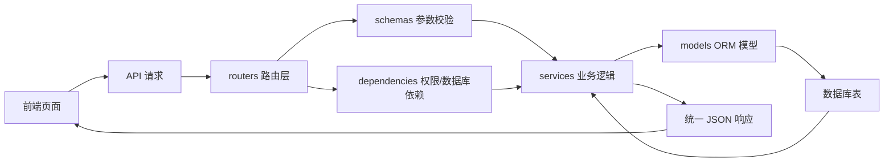

对应代码：

- `backend/app/routers/*.py`：接口入口。
- `backend/app/schemas.py`：检查请求参数。
- `backend/app/dependencies.py`：提供数据库连接和角色权限。
- `backend/app/services.py`：业务逻辑。
- `backend/app/models.py`：数据库表映射。

你要记住：

```text
routers 不做复杂业务，复杂业务交给 services。
schemas 不写数据库，只负责参数是否合格。
models 不处理流程，只描述表结构和关系。
```

## 2. 登录流程

接口：

```text
POST /api/auth/login
```

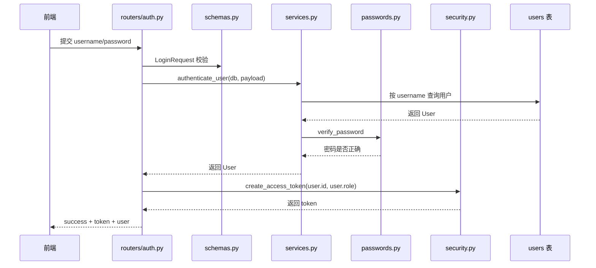

答辩关键词：

```text
参数校验、用户表查询、密码哈希校验、token、角色权限
```

## 3. 创建船员流程

接口：

```text
POST /api/crews
```

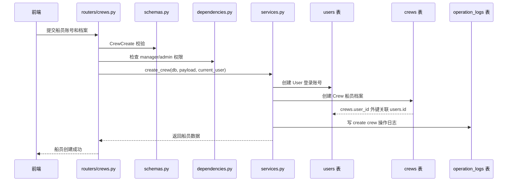

表关系：

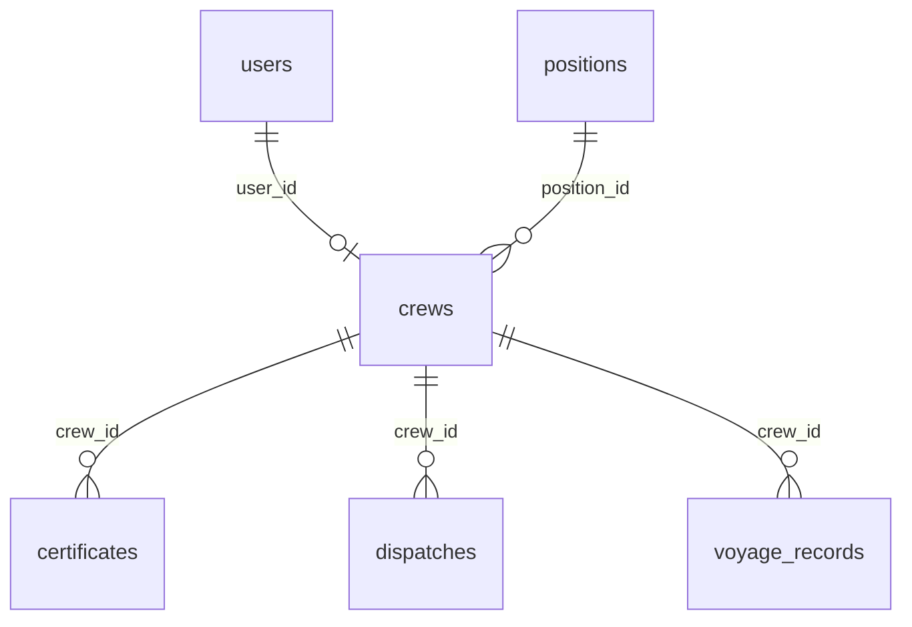

答辩关键词：

```text
users 负责登录，crews 负责业务档案，一对一外键关联
```

## 4. 证书审核流程

接口：

```text
POST /api/certificates
PUT /api/certificates/{certificate_id}/review
```

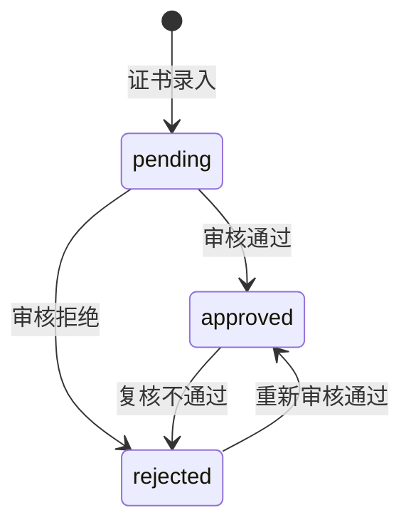

审核写库流程：

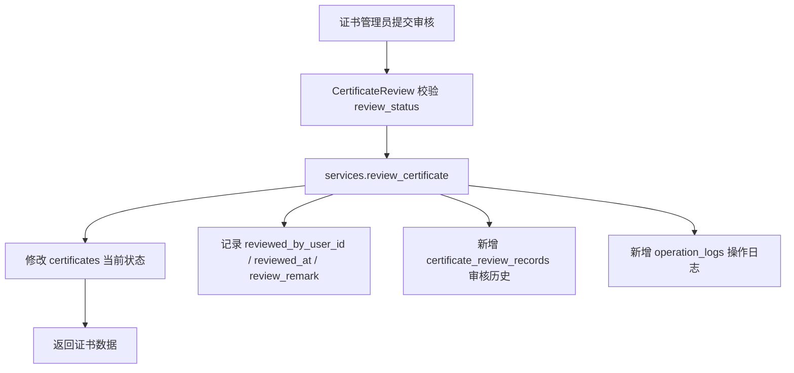

证书能参与匹配的条件：

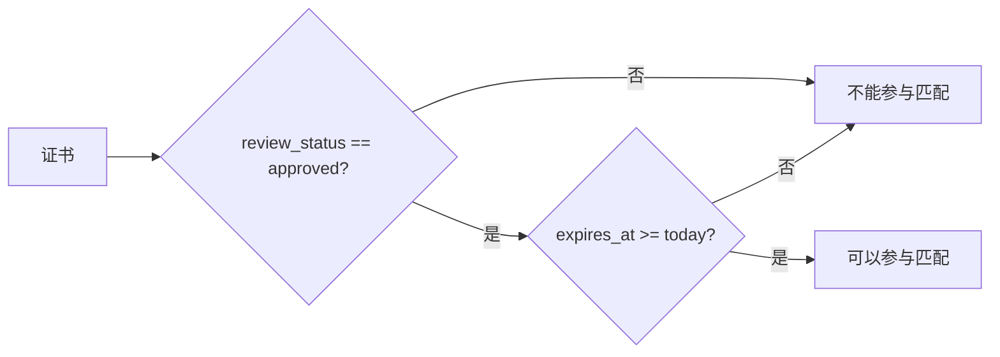

答辩关键词：

```text
当前状态在 certificates，历史审核在 certificate_review_records。
只有 approved 且未过期证书参与智能匹配。
```

## 5. 岗位需求和智能匹配流程

接口：

```text
POST /api/jobs
GET /api/jobs/{job_id}/matches
```

岗位需求关系：

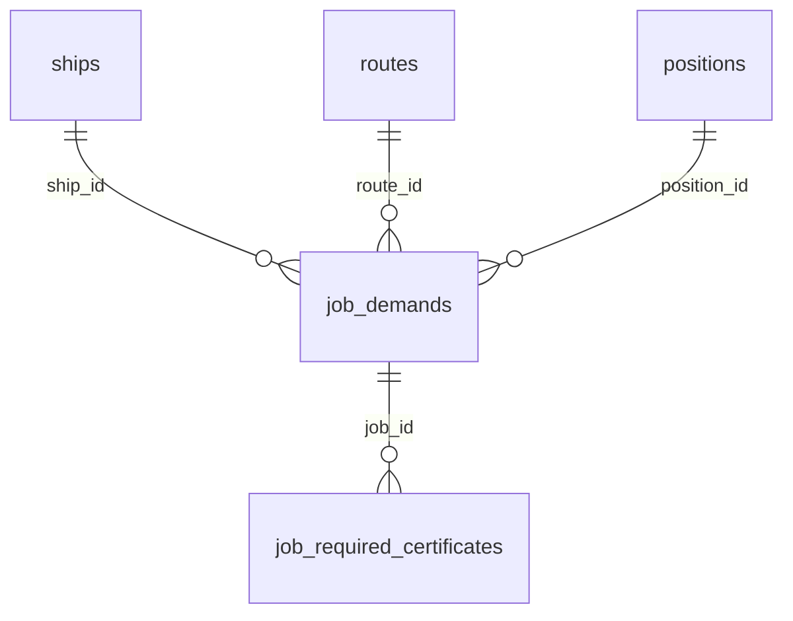

匹配流程：

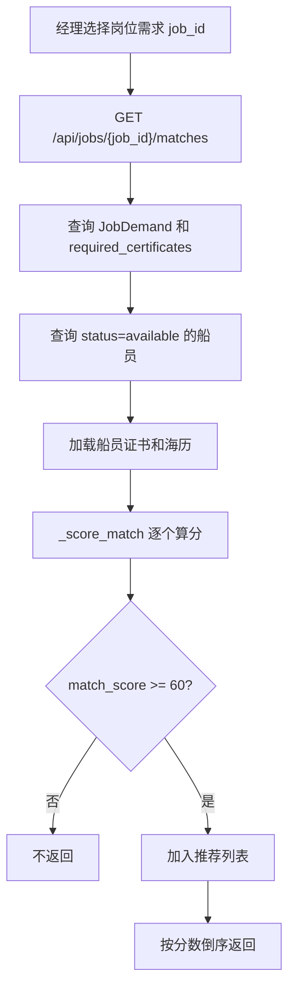

评分模型：

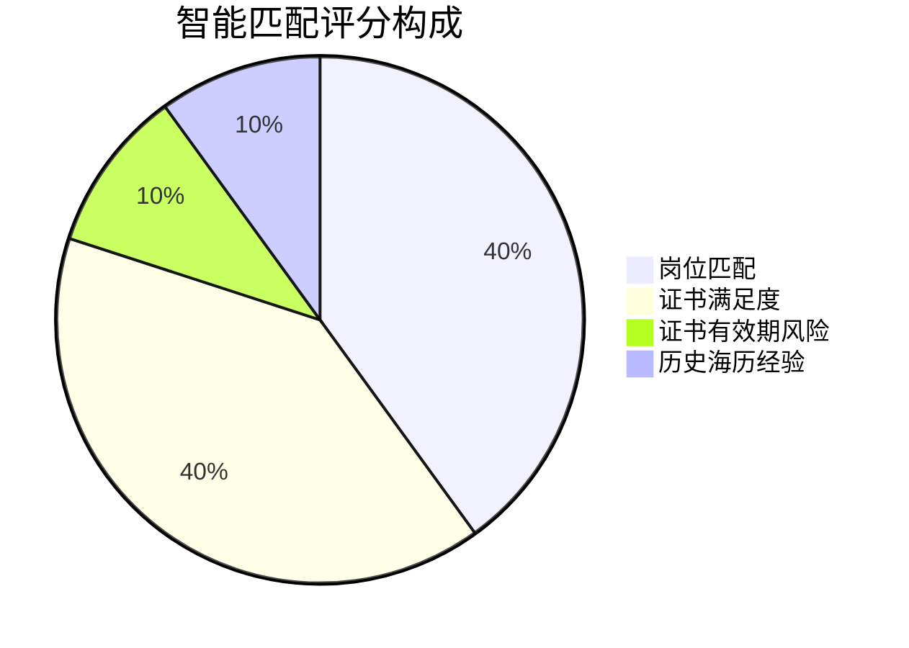

答辩关键词：

```text
不是简单查询，是可解释评分模型。
返回 match_score、match_reasons、missing_certificates、certificate_risk。
```

## 6. 派遣状态流转

接口：

```text
POST /api/dispatches
PUT /api/dispatches/{id}/confirm
PUT /api/dispatches/{id}/onboard
PUT /api/dispatches/{id}/offboard
PUT /api/dispatches/{id}/cancel
```

状态机：

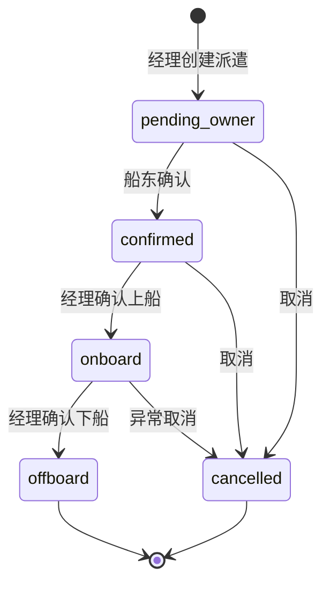

表联动：

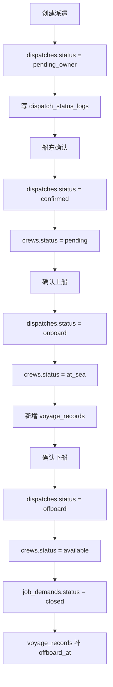

创建派遣前的后端校验：

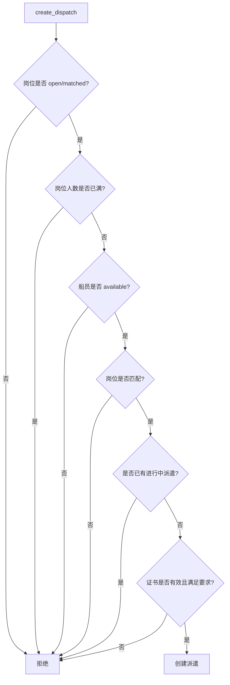

答辩关键词：

```text
派遣是状态机；状态变化写 dispatch_status_logs；上船自动生成海历。
```

## 7. 统计首页和日志

接口：

```text
GET /api/dashboard/summary
GET /api/dashboard/crew-status
GET /api/dashboard/certificate-alerts
GET /api/dashboard/dispatch-trend
GET /api/dashboard/route-workload
GET /api/operation-logs
```

统计数据来源：

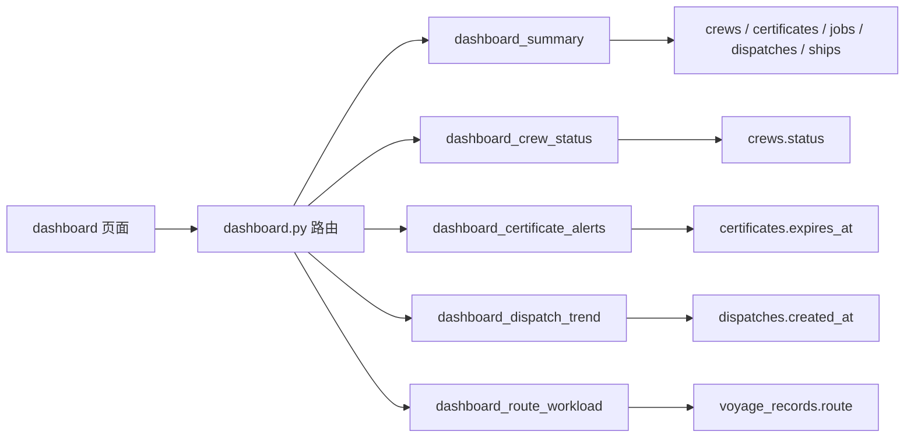

日志区别：

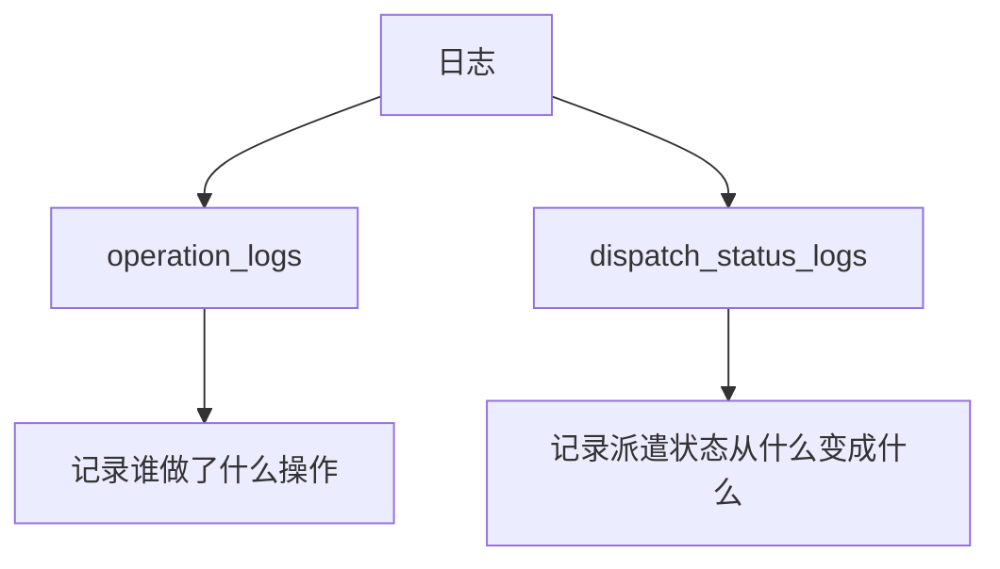

答辩关键词：

```text
前端负责展示，后端负责统计，数据库负责保存真实业务数据。
```

## 8. 复习时怎么用这份图

每看一张图，就打开对应代码：

| 图 | 对应代码 |
| --- | --- |
| 整体请求链路 | `main.py`、`dependencies.py` |
| 登录流程 | `routers/auth.py`、`services.authenticate_user` |
| 创建船员 | `routers/crews.py`、`services.create_crew` |
| 证书审核 | `routers/certificates.py`、`services.review_certificate` |
| 智能匹配 | `routers/matching.py`、`services._score_match` |
| 派遣状态流转 | `routers/dispatches.py`、派遣相关 service |
| 统计首页 | `routers/dashboard.py`、dashboard service |

你最终要做到：

```text
看到图能说代码，看到代码能画图。
```

