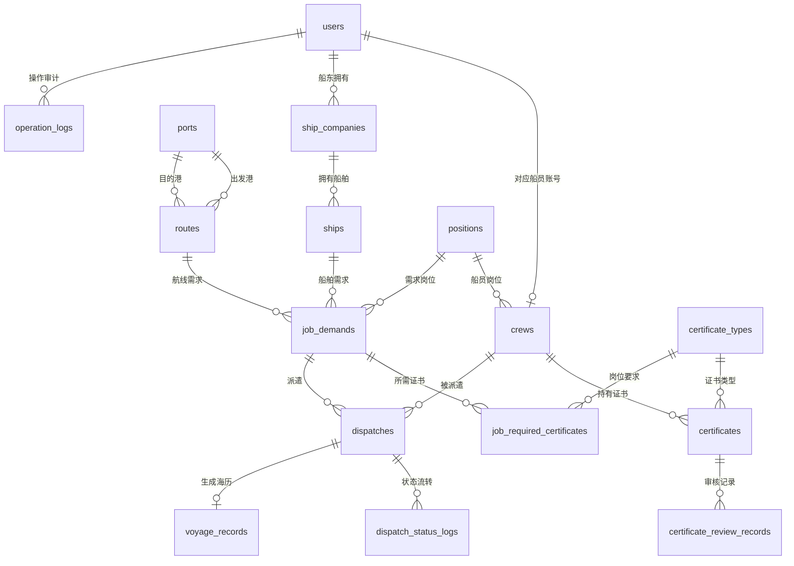

# 出海船员管理系统数据库设计说明

## 设计目标

本系统面向船员资源调度业务，核心目标是把“船东发布岗位需求、业务经理匹配船员、证书管理员审核证书、派遣后生成海历”的流程落到数据库关系中。数据库设计重点包括实体拆分、外键约束、状态约束、唯一约束、索引、审核日志、状态日志和统计视图。

## ER 图

## 核心数据字典

| 表名 | 作用 | 关键设计 |
| --- | --- | --- |
| `users` | 登录用户和角色 | `username` 唯一，`role` 使用 CHECK 约束 |
| `crews` | 船员档案 | 关联 `users` 和 `positions`，身份证唯一，状态 CHECK |
| `positions` | 岗位字典 | 避免岗位名称散落在业务表中 |
| `certificate_types` | 证书类型字典 | 保存证书默认有效期和是否必备 |
| `certificates` | 船员证书 | 关联船员和证书类型，含审核状态、到期日期 |
| `certificate_review_records` | 证书审核流水 | 保留每次审核前后状态和备注 |
| `ship_companies` | 航运公司/船东主体 | 关联船东用户 |
| `ships` | 船舶档案 | 船名唯一，关联航运公司 |
| `ports` | 港口字典 | 港口名称唯一 |
| `routes` | 航线字典 | 由出发港、目的港和航线名组成唯一约束 |
| `job_demands` | 船东岗位需求 | 关联船舶、航线、岗位和发布船东 |
| `job_required_certificates` | 岗位证书要求 | 一个岗位可要求多个证书 |
| `dispatches` | 派遣记录 | 连接岗位和船员，状态为派遣流程主线 |
| `dispatch_status_logs` | 派遣状态日志 | 记录每次状态变化 |
| `voyage_records` | 海历记录 | 上船生成，下船补全下船时间 |
| `operation_logs` | 操作日志 | 记录关键业务操作，支持审计展示 |

## 状态设计

船员状态：`available` 在岸可派遣、`pending` 待上船、`at_sea` 出海中、`inactive` 已停用。

证书审核状态：`pending` 待审核、`approved` 审核通过、`rejected` 审核拒绝。只有 `approved` 且未过期的证书参与岗位匹配。

派遣状态：`pending_owner` 待船东确认、`confirmed` 已确认、`onboard` 已上船、`offboard` 已下船、`cancelled` 已取消。

## 统计视图

| 视图名 | 用途 |
| --- | --- |
| `v_crew_certificate_status` | 展示每名船员证书审核和有效期风险 |
| `v_dispatch_flow_stats` | 统计不同派遣状态数量 |
| `v_route_workload` | 统计每条航线海历数量和在船数量 |
| `v_job_match_overview` | 展示每个岗位可匹配的岗位人数和证书要求数量 |

## 四人分工建议

| 成员 | 主要职责 | 可交付物 |
| --- | --- | --- |
| 组长 | 数据库设计、ER 图、数据字典、`init.sql`、最终整合 | 数据库脚本、设计说明、答辩主线 |
| 组员 A | 后端接口、业务规则、匹配评分、日志、统计接口 | FastAPI 路由、service、接口测试 |
| 组员 B | 前端页面、统计可视化、表格筛选和业务操作 | 管理端页面、演示截图 |
| 组员 C | 报告、PPT、测试用例、部署说明 | 需求分析、流程图、测试表、演示流程 |

## 答辩讲解主线

1. 先讲业务流程：船东发布岗位，经理按岗位和证书匹配船员，船东确认后上船，下船生成完整海历。
2. 再讲数据库：哪些是实体表，哪些是字典表，哪些是关系表，哪些是日志表。
3. 重点强调约束：账号唯一、身份证唯一、证书编号唯一、状态 CHECK、外键保证引用完整性。
4. 展示统计：船员状态、证书到期、派遣趋势、航线工作量都来自数据库查询或视图。
5. 最后展示可运行系统：登录、证书审核、岗位匹配、派遣流转、日志记录。
